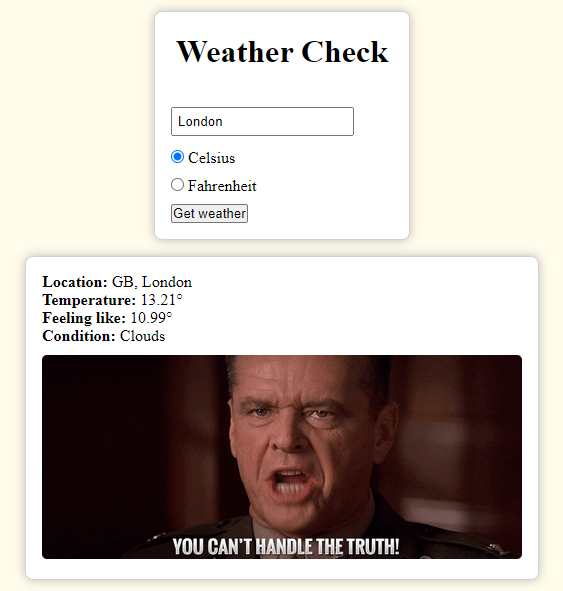

# Weather Check

Check the weather in a specific city and get a gif depending on the weather conditions. This app is built to practice the use of promises and async functions.

## Screenshot

## Features

- Get the city's weather in either Celsius or Fahrenheit.
- A gif is loaded depending on the weather conditions.
- Additional details like country, temperature, and estimate of how the temperature feels, are presented.

## Potential Features

- Change background depending on the temperature.
- See forecast for a specific time.

## Built With

- HTML & CSS
- JavaScript/ES6 + Async/await
- NPM + Webpack

## Live Demo

[Visit Live Demo](http://sebgil.me/WeatherApp/)

## Author

👤 **Sebastian Gil Rodriguez**

- Github: [@sebGilR](https://github.com/sebGilR)
- Twitter: [@sebGilR](https://twitter.com/sebGilR)
- Linkedin: [sebastiangilrodriguez](https://www.linkedin.com/in/sebastiangilrodriguez)

## 🤝 Contributing

Contributions, issues and feature requests are welcome!

Feel free to check the [issues page](issues/).

## Show your support

Give a ⭐️ if you like this project!
